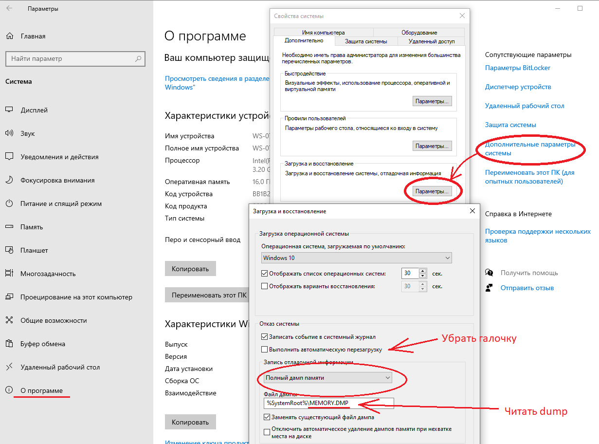

# Ошибки сборки компьютера папы

На машине установлен процессор Intel Core i5 10400. Ключевые особенности: socket FCLGA1200, PCIe 3.0.

При первоначальной сборке компьютера был не правильно установлен процессор: раньше использовался разъём PGA (_Pin Grid Array_) - у процессора были ножки, а не слоте материнской платы - разъёмы. У современных процессоров успользуется LGA (_Land Grid Array_) - на материнской плате подпружиненный контакты, а на процессоре - шариковые контакты. На старых разъёмах процессор устанавливался сверху и придавливался рычажком сверху с усилием. На современных разъёмах следует аккуратно положить процессор на площадку, добиться установки в фиксационное положение скольжением и затем без усилия закрепить процессор в разъёме с помощью рычажка. Из-за того, что процессор не был доведён до фиксационного положения и рычажок был зафиксирован с усилием, деформировалась контактная ножка в слоте процессора на материнской плате.

Деформация была найдена и грубо исправлена вручную, что дало полтора года беспроблемной эксплуатации системы.

Весной 2022 года было принято решение заменить боксовый cooler на Zalman CNPS10X PERFORMA ST (860 грамм). Кулер очень эффективно отводит тепло, но для его фиксации на LGA1200 используется переходник/адаптер с двумя местами фиксации (а не четырьмя). При установке системного блока в вертикальное положений нарушается равномерное прилегание кулера к процессору и система перестаёт работать стабильно, систематически зависая, либо не загружаясь. Было принято техническое решение - разместить системый блок в горизонтальной состоянии.

В октябре 2022 года снова начались зависания системы на старте. Анализ сбоев по индикаторам материнской платы позволил установить, что проблема связана с интегрированной видео-картой. По всей видимости, был деформирован один из контактов сокета, через который осуществляется взаимодействие встроенной в процессор GPU c материнской платой. Было принято решение установить дискретную видеокарту GeForce GTX 1060 и отключить в BIOS/UEFI интегрированную карту.

26 ноября 2023 года несколько раз возникали зависания при старте системы. Жесткая перезагрузка решала проблему. Event Log дал мутные подсказки. При выполнении команды `sfc /scannow` была идентифицирована ошибка с расхождением целостности компонентов платформы .NET. Так же в логах было указание на ошибки, связанные с утилитой Gigabyte для управления подсветкой. Указывалось, что утилиты Gigabyte не совместимы с механизмом целостности памяти, внедрённой в патчи безопасности Windows 11. Все утилиты Gigbyte были удалены. В течение нескольких следующих дней я каждый раз запускал систему и каждый день сталкивался с зависанием при первой загрузке операционной системы. Сообщения об ошибках в Event Log были разнообразными (включая нарушения контрольной суммы .NET Core). Были выполнены следующие изменения в системе:

- установлены новые драйвера материнской платы
- отключен режим быстрой загрузки
- обновлён BIOS
- обновлены драйвера видео-карты

Важно заметить, что "быстрая загрузка" действительно очень круто работает на SSD-дисках. Субьективно, компьютер загружается без "быстрой загрузки" в три раза медленнее. Если проблема с зависаниями полечится, нужно будет попробовать вернуть обратно быструю загрузку.

30 ноября 2023 года зависания продолжались, однако при анализе аппаратной конфигурации удалось выявить, что Windows не может идентифицировать и корректно проинициализировать последнее подключенное USB-устройство, который оказался USB Hub. Этот USB-хаб работает постоянно и питается не от компьютера, а от сети (он него заряжается мобильный телефон). После сброса питания хаба, он был успешно распознан Windows и следующая "холодная" загрузка успешно выполнилась.

1 декабря 2023 года система запустилась без зависаний, но с перезагрузками и последующей необходимостью восстановления файловой системы. В приложении "Windows Security" закладка "Device Security" имела иконку "Проблемы". При переходе в раздел, на экран выдавалась информация о том, что "Core Isolation" был отключен из-за наличия несовместимых драйверов. В списке несовместимых оказались драйвера для видеокамеры Logitech, датированные 2012 годом: lvbflt64.sys, lvrs64.sys и lvuvc64.sys. Для того, чтобы удалить эти драйвера можно воспользоваться командой `pnputil`, запускаемой с повышенными привилегиями.

Отобразить все сторонние драйверы можно командой:

```shell
pnputil -e
```

Команда вывела информацию о драйверах Logitech, в том числе, указав inf-файлы, связанные с этими драйверами. Для удаления драйверов были выполнены команды:

```shell
pnputil -d oem23.inf
pnputil -d oem43.inf
pnputil -d oem63.inf
```

После перезагрузки, "Device Security" позволил активировать изоляцию ядра - ошибка в этом приложении больше не выводилась.

Второе декабря - зависание на старте. В электронном журнале сообщение: "Инициализирован отчет об ошибке IOMMU". В интернете есть множество сообщений с указанием на проблему с видео-картой, или процессором/материнской картой. При попытке запуска утилиты настройки профиля работы компьютера "GIGABYTE EasyTune" получил сообщение о том, что она не работает в режиме защиты памяти и его нужно отключить. При отключении режима и повторном запуске **EasyTune** получил сообщение о том, что был нарушен профиль работы системы и его нужно восстановить. Восстановил, перезапустил систему.

Продолжаются проблемы с ESET Internet Security, который не может загрузить свои обновлённые компоненты через интернет. **UPDATE**: проблема решилась только полным удалением и переустановкой приложения. При этом пришось выполнять управление лицензиями, поскольку сервер посчитал, что устанавливаются дополнительные лицензии.

Зависания при холодном старте продолжаются. Чаще всего с этим связано следующее сообщение в системном журнале:

```log
Выполнено перечисление термальной зоны ACPI \_TZ.TZ00.             
_PSV = 0 K             
_TC1 = 0             
_TC2 = 0             
_TSP = 0 мс             
_AC0 = 344K             
_AC1 = 328 K             
_AC2 = 323 K             
_AC3 = 318 K             
_AC4 = 313 K             
_AC5 = 0 K             
_AC6 = 0 K             
_AC7 = 0 K             
_AC8 = 0 K             
_AC9 = 0 K             
_CRT = 392 K             
_HOT = 0 K             
Минимальное регулирование = 0             
_CR3 = 0 K
```

Критическая температура, при которой осуществляется выключение (_CRT)  = 392 K, т.е. она не достигается. TZ.TZ00 - это информация о микропроцессоре.

Продолжая исследовать электронный журнал, обратил внимание на следующее сообщение об ошибке: "Не удается найти описание для идентификатора события 56 из источника Application Popup. Вызывающий данное событие компонент не установлен на этом локальном компьютере или поврежден. Установите или восстановите компонент на локальном компьютере". Данная проблема обсуждается на [различных форумах](https://answers.microsoft.com/ru-ru/windows/forum/all/%D0%BE%D1%88%D0%B8%D0%B1%D0%BA%D0%B0-56-aplication/2dc2408f-489a-4bd8-9efd-4c58e558993f?page=2) и имеет отношение к приложениям App Center/EasyTune от GIGABYTE. Множество пользователей склоняется к мнению, что это приложение источник множества проблем и рекомендуют удалить его. Дополнительно пользователи рекомендуют:

- в UEFI/BIOS, в разделе Platform Power, установить параметр "Power Loading" в значение Enabled. Этот параметр позволяет избежать сбоев при работе на мылых нагрузках. Как оказывается, не все блоки питания поддерживают команды перехода в режим экономии питания и, как следствие, может нарушаться режим работы
- Не активировать режим экономии питания, используя "Сбалансированный"
- удалить все компоненты AppCenter, включая сервис OCButtonService: `sc delete OCButtonService`

9 декабря 2023 года возникла проблема с работой мыши "Logitech MX Anywhere 3" - не работал Receiver, Windows видела его как нераспознанное устройство, которое работает не правильно. При этом мышь и receiver прекрасно запустились на Linux-ноутбуке. При долгом простое в сне, при выходе из сна система зависает. Под подозрением - материнская плата/процессор.

## Проверка работоспособности системы под Linux

Одной из основных гипотез объясняющих причины зависаний компьютера является проблема с некорректным поведением драйвера операционной системы, а не критичный аппаратный сбой. Для проверки этой гипотезы были выполнено несколько попыток загрузки системы с USB-диска с установленным образом Linux Mint 18.04.

Все попытки загрузки операционной системы были безусловно успешными (четыре попытки в разные временные моменты).

Драйвера видео-карты Nvidia успешно применялись. Система выбирала из нескольких вариантов - _open source_, хотя можно было выбрать и проприетарный драйвер от Nvidia. Поддержка двух мониторов доступна "из коробки".

Единственная проблема - отсутствует поддержка USB-контроллер для доступа к сети Интернет по Wi-Fi: **TP-Link Archer T4U Plus**. На ноутбуке я уже [успешно устанавливал драйвера для Archer T2U Plus](https://github.com/Kerminator1973/RPIDev/blob/main/prepareNotebook.md). Загрузить официальную инструкцию можно по [ссылке](https://www.tp-link.com/ru/support/download/archer-t4u/). Репозитарий с исходными текстами драйвера доступен на [Github/morrownr](https://github.com/morrownr/88x2bu-20210702). Следует заметить, что для сборки драйвера нужно иметь совместимое ядро. В случае Ubuntu, драйвер совместим с 22.04 (kernel 5.15) and 22.10 (kernel 5.19, kernel 6.2). Процедура сборки требует доступа в Интернет для докачивания зависимостей, т.е. важным является наличие проводного подключения на первом этапе.

В обсуждении на [DNS-Club](https://club.dns-shop.ru/discussions/t-283-adapteryi-wi-fi/189724-wi-fi-adapter-tp-link-archer-t4u-plus/) приводится указание на то, что драйвер успешно устанавливается из исходников и по инструкции [RinCat](https://github.com/RinCat/RTL88x2BU-Linux-Driver). В списке совместимых аппаратных модулей присутствует **T4U Plus**. Тем не менее, в разных версиях модуля могут быть использованы разные чипы. В версии V.1 используется rtl8812au, а начиная с V.3 - 88x2bu. Кроме этого, указывается на необходимость дополнительной настройки соединения через USB 3.0 (более высокая скорость обмена данными).

**Update**: при использовании USB-диска с Ubuntu Mate 23.04, Wi-Fi адаптер автоматически подхватился даже в Try-режиме работы с операционной системой.

## Рекомендации Максима Кривошеева

Следует установить максимальный уровень логирования процесса загрузки ядра операционной системы, что даст много дополнительной информации:



Рекомендуется сбросить питание с процессора и материнской платы. Поскольку система питается от UPS, питание реально никогда не сбрасывается.

Также рекомендуется сбросить BIOS до стандартных настроек.

Максим рекомендует отключить Wi-Fi адаптер для того, чтобы гарантировать, что _Real-Time Clock_ работает. При включенном Wi-Fi-адаптере, операционная система может синхронизовать время через Интернет.

**Экспериментальная проверка**: сброс питания и отключение Wi-Fi модуля не привели к прекращению зависания компьютера на процедуре Logon. Однако, при отсутствии Интернета, система показала правильный часовой пояс, но фактическое время на три часа меньше, чем было в действительности. Из-за какого-то глюка три часа "потерялись". При подключении Wi-Fi модуля, был запущен процесс синхронизации времени через интернет, который успешно скорректировал время.

В системной папке (%SystemRoot%\LiveKernelReports) был обнаружен ряд папок, в которых находились dmp-файлы: "\WHEA\WHEA-20231126-1801.dmp" и "\WHEA\WHEA-20231130-1959.dmp". Для анализа этих файлов потребовалось установить утилиту **WinDbg**, которую я скачал с сайта Microsoft (Debugging Tools for Windows из набора Software Development Kit (SDK)). Приложение было установлено в папку `c:\Program Files (x86)\Windows Kits\10\Debuggers\x64\windbg.exe`.

В dmp-файлах есть следующая информация (WHEA-20231126-1801.dmp):

```log
WHEA_UNCORRECTABLE_ERROR (124)
A fatal hardware error has occurred. Parameter 1 identifies the type of error
source that reported the error. Parameter 2 holds the address of the
nt!_WHEA_ERROR_RECORD structure that describes the error condition. Try !errrec Address of the nt!_WHEA_ERROR_RECORD structure to get more details.
Arguments:
Arg1: 0000000000000007, BOOT Error
Arg2: ffff880f6f4ab020, Address of the nt!_WHEA_ERROR_RECORD structure.
Arg3: 0000000000000000
Arg4: 0000000000000000


PROCESS_NAME:  smss.exe

STACK_TEXT:  
fffffe05`34bd9e30 fffff804`7d8071f7     : ffff880f`6f4ab000 00000000`00000000 ffff880f`6f4ab020 000000b4`a98ff498 : nt!LkmdTelCreateReport+0x1d4
fffffe05`34bda370 fffff804`7d8070ee     : ffff880f`6f4ab000 fffffe05`34bdaa60 00000000`00000000 00000000`00000000 : nt!WheapReportLiveDump+0x7b
fffffe05`34bda3b0 fffff804`7d650195     : 00000000`00000001 fffffe05`34bdaa60 00000000`00000000 00000000`00000000 : nt!WheapReportDeferredLiveDumps+0x7a
fffffe05`34bda3e0 fffff804`7d54fde1     : 00000000`00000000 00000000`00000000 00000000`00000001 fffff804`813aa22c : nt!WheaCrashDumpInitializationComplete+0x59
fffffe05`34bda410 fffff804`7d22b6e5     : ffff880f`76593080 00000000`00000000 00000000`0000022c 00000000`00000001 : nt!NtSetSystemInformation+0x971
fffffe05`34bda9e0 00007ffc`b4192a84     : 00000000`00000000 00000000`00000000 00000000`00000000 00000000`00000000 : nt!KiSystemServiceCopyEnd+0x25
000000b4`a98ff438 00000000`00000000     : 00000000`00000000 00000000`00000000 00000000`00000000 00000000`00000000 : 0x00007ffc`b4192a84
```

Второй файл ("\WHEA\WHEA-20231130-1959.dmp") содержит ту же самую информацию.

SMSs - это аббревиатура от **S**essions **M**anager **S**ubsystem. Программа Session Manager Subsystem отвечает за все виды деятельности, связанные с запуском, обработкой и заканчивая пользовательскими сеансами в ОС Windows версии 2000 и последующих. Она вызывает процедуры Windows Logon (winlogon) и Client/Server Runtime Service (csrss). Она также работает с клиентскими сеансами в службах терминалов (Terminal Services). Она является основной частью операционной системы и не должна отключаться.

Поскольку зависания возникают после работы Bootloader-а и часто появляется частично прорисованное окно ввода логина/пароля, то сбой в SMSS вероятен.
